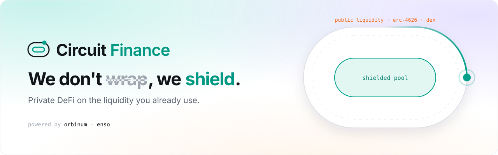

  <a href="https://rheeunion.github.io/circuit-demo/"><b>Open the demo →</b></a>

**Circuit Finance** is private DeFi on the liquidity that already exists. Deposit into a public ERC-4626 vault through one Enso route, and hold the position privately as a note in the Orbinum shielded pool.

This repository only hosts the static demo build. Source code is private.

## Try it

1. Open the demo in a browser with an EVM wallet (MetaMask, Rabby or similar).
2. **Connect wallet**, then **Unlock private balance**. One signature, no gas.
3. **Add funds** once, in a fixed size. It lands with the next batch (or tap **Settle now** in your portfolio).
4. **Swap**, **Earn** and **Send** privately. **Prove** creates a file an auditor can check under **Verify**.

## Simulation mode

| Live | Simulated in your browser |
|---|---|
| Enso routes and quotes | Shielded pool, Merkle tree and nullifiers |
| ERC-4626 vault share prices on Base | Withdraw proofs (mock prover) and the relayer |

**No funds move.** Circuit is in development and has not been audited.

Powered by <b>Orbinum</b> · <b>Enso</b>

